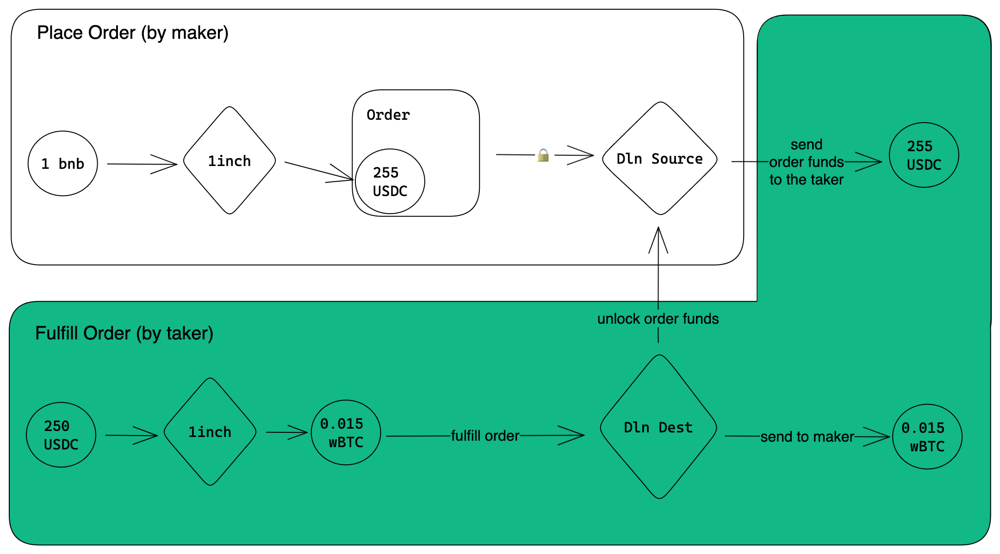

# `dln-taker`

[](https://github.com/debridge-finance/debridge-security/blob/master/Debridge_solana_tx_parser_Whitebox_Pentest_Report_Halborn_Final.pdf)

`dln-taker` is the rule-based daemon service built to automatically execute profitable orders placed on the deSwap Liquidity Network (DLN) across supported blockchains.

- [TL;DR](#tldr)
- [About DLN](#about-dln)
- [How `dln-taker` works?](#how-dln-taker-works)
- [Installation](#installation)
  - [Preparing the environment](#preparing-the-environment)
  - [Understanding reserve funds](#understanding-reserve-funds)
  - [Deploying reserve funds](#deploying-reserve-funds)
- [Managing cross-chain risk/reward ratio](#managing-cross-chain-riskreward-ratio)
  - [Reducing transaction finality constraint](#reducing-transaction-finality-constraint)
  - [Setting a TVL budget](#setting-a-tvl-budget)
  - [Setting throughput](#setting-throughput)
  - [Delayed fulfillments](#delayed-fulfillments)
- [Testing the order execution flow in the wild](#testing-the-order-execution-flow-in-the-wild)
  - [Restricting orders from fulfillment](#restricting-orders-from-fulfillment)
  - [Placing new orders](#placing-new-orders)

## TL;DR

- Make a new directory:
```sh
mkdir dln-taker-env
```
- `cd` to the directory and install necessary production dependencies:
```sh
cd dln-taker-env
npm i --save typescript ts-node @debridge-finance/dln-taker
```
- Create a configuration file called `executor.config.ts` based on sample:
```sh
wget https://raw.githubusercontent.com/debridge-finance/dln-taker/main/sample.config.ts
mv sample.config.ts executor.config.ts
```
- Create a secrets file called `.env` based on sample:
```sh
wget https://raw.githubusercontent.com/debridge-finance/dln-taker/main/sample.env
mv sample.env .env
```
- Set the values to variables defined in the secrets `.env` file ([more info](#preparing-the-environment))
- Deploy reserve funds to the addresses you have defined in the secrets `.env` file ([more info](#deploying-reserve-funds))
- Launch `dln-taker` via `npx`:
```sh
npx dln-taker executor.config.ts
```
- You would see how `dln-taker` executes orders being placed on the DLN

## About DLN

DLN is an on-chain system of smart contracts where users (we call them *makers*) place their cross-chain limit orders, giving a specific amount of input token on the source chain (`giveAmount` of the `giveToken` on the `giveChain`) and specifying the outcome they are willing to take on the destination chain (`takeAmount` of the `takeToken` on the `takeChain`). The given amount is being locked by the DLN smart contract on the source chain, and anyone with enough liquidity (called *takers*) can attempt to fulfill the order by calling the DLN smart contract on the destination chain supplying requested amount of tokens the *maker* is willing to take. After the order is being fulfilled, a cross-chain message is being sent to the source chain via the deBridge protocol to unlock the funds, effectively completing the order.


## How `dln-taker` works?

From the high level perspective, `dln-taker` automates the process of order estimation and execution: it
- **captures new orders** being placed onto DLN by subscribing to the deBridge-managed websocket service which monitors the smart contracts under its hood,
- **filters out orders satisfying custom criteria** defined in the config (e.g., amount cap, target recipient, etc),
- **asserts necessary conditions** to be met (e.g., minimum block confirmations, minimum required profitability), postponing those that don't,
- attempts to **fulfill the order** supplying the requested amount of tokens,
- and **unlocks the funds** upon successful order execution (making this in batches of 10 orders per every supported chain combination),
- regularly **gets back to orders** previously postponed due to being unprofitable.


## Installation

See [TL;DR section](#tldr) for quick install.

### Preparing the environment

The [`sample.config.ts` file](./sample.config.ts) already defines all blockchains where DLN is operational:
1. Arbitrum
1. Avalanche
1. Base
1. BNB Chain
1. Ethereum
1. Fantom
1. Linea
1. Optimism
1. Polygon
1. Solana

so you don't have to describe them explicitly. However, the sample config uses references to the environment variables (via the `${process.env.*}` notation) where sensitive or private data is involved: for example, an API key to access deBridge-managed websocket, or private keys to wallets with reserve funds for order fulfillment are designed to be accessed by the configuration file as environment variables.

For the sake of simplicity, all variables requested by the `sample.config.ts` are listed in the [`sample.env` file](./sample.env). You can use it as the foundation to create an `.env` file to store your secrets, or reuse it in a hardened way (involving vaults, e.g. Github Secrets or 1password Secrets Automation).

Create an `.env` file using the contents of the [`sample.env` file](./sample.env) file, and set values for all variables for every chain you wish to support, as follows:

> **Caution!** Properties from this section define sensitive data used by `dln-taker` to operate reserve funds.

- `<CHAIN>_RPC` variable defines a URL to the RPC node of the chain.
- `<CHAIN>_TAKER_PRIVATE_KEY` variable defines the private key of the address where the reserve funds available for orders fulfillment. `dln-taker` will sign transactions on behalf of this address, effectively setting approval, transferring funds, performing swaps and fulfillments.
- `<CHAIN>_UNLOCK_AUTHORITY_PRIVATE_KEY` variable defines the private key of the address used to unlock successfully fulfilled orders. `dln-taker` will sign transactions on behalf of this address, effectively unlocking the orders.
- `<CHAIN>_BENEFICIARY` variable defines taker controlled address where the orders-locked funds (fulfilled on the other chains) would be unlocked to. For this you can use the address which corresponds to the private key specified as the `<CHAIN>_TAKER_PRIVATE_KEY`, so funds unlocked by fulfilling the orders would be automatically available as the reserve funds.

> ⚠️ The easiest way to obtain private keys is to export them from your wallets: this would give you a confidence that you are passing the key of the proper account to the dln-taker instance. Consider looking at the [support article](https://support.metamask.io/hc/en-us/articles/360015289632-How-to-export-an-account-s-private-key) explaining how to export a private key from Metamask, or a [video](https://youtu.be/UL4gEsGhtEs?t=243) explaining the same thing for the Phantom wallet.
> ❗️ Exporting your account could be risky as it displays your private key in clear text. To avoid possible loss of funds, make sure no one else sees or is able to capture a screenshot while you retrieve your private key.

The next step is to deploy your assets to the addresses used by `dln-taker` for order fulfillment. Refer the [next section](#deploying-reserve-funds) for details.

If you wish to avoid order fulfillments in a particular chain, use the [`disableFulfill`](./ADVANCED.md#disablefulfill) filter in the config file, however you are **still required** to fill the variables with correct values to enable orders coming from such chain. For example, if you wouldn't want to deploy liquidity on Solana (and thus avoid fulfillments in this chain), add the `disableFulfill` filter to the Solana's section of the configuration file, but you'll still be able to fulfill orders coming **from** Solana. If you wish to exclude the chain from processing, skipping orders coming from and to such chain, just comment out the corresponding section in the config file: in this case, any order coming from or to Solana would be dropped by your instance of `dln-taker`.


### Understanding reserve funds

**Reserve funds** are liquid assets deployed by the taker `dln-taker` uses to fulfill orders.

The core on-chain DLN protocol is designed to work with arbitrary tokens on either side: a user who places an order can **give** arbitrary token and **take** arbitrary token (e.g., create an order giving 1 BNB and taking 0.015 wBTC). To avoid price fluctuations and protect takers from financial losses, users placing orders through the deBridge app and the API are implicitly forced to swap their arbitrary input token to the trusted liquid token from the supported bucket of tokens, which is then being locked by the source smart contract as the give token.

`dln-taker` is designed to match reserve funds against orders' locked give token, assuming that tokens of the same bucket across chains have equal value and near-zero re-balancing costs. For example:
- a user places an order giving 1 BNB on BNB chain taking 0.015 wBTC on Ethereum,
- the deBridge app swaps the input 1 BNB to 255 USDC on BNB chain before order creation,
- `dln-taker` matches 255 USDC locked on BNB to 255 USDC on Ethereum, deducts operating expenses and margin resulting, e.g., 250 USDC, automatically swaps 250 USDC to wBTC using the best market route picked by the 1inch router, and fulfills the order if the swap's outcome is greater than or equal to the amount requested by the order.



As for now, deBridge uses two buckets of tokens for asset routing:
1. the USDC token, emitted by Circle Inc. on every DLN supported chain, and
1. the ETH coin, on Ethereum, Arbitrum, Base and Linea, and
1. the wETH token, on Avalanche, BNB Chain and Polygon

Both buckets are explicitly defined in the sample configuration file [here](./sample.config.ts)), so every taker is required to **load theirs address with enough USDC and ETH on every chain you are willing to fulfill orders on**.

### Deploying reserve funds

For every chain you as a taker would like to support:
- Register the reserves-keeping address (its private key must be set as a `takerPrivateKey` in the configuration file) and load it with:
  - a given amount of USDC tokens (e.g., 100,000 USDC),
  - a given amount of ETH (e.g. 60 ETH) on Arbitrum, Base, Ethereum, Linea and Optimism,
  - a given amount of wETH tokens (e.g. 60 wETH) on Avalanche, BNB Chain and Polygon,
  - a reasonable amount of native blockchain currency (e.g., 1 ETH on Ethereum) to pay gas for fulfillment transactions.
- Register the unlock authority address (its private key must be set as an `unlockAuthorityPrivateKey` in the configuration file) and load it with:
  - a reasonable amount of native blockchain currency (e.g. 1 ETH on Ethereum) to pay gas for order unlocking transactions.

## Managing cross-chain risk/reward ratio

### Reducing transaction finality constraint

Executing cross-chain transactions is all about managing risks properly: no one wants to perform actions on the destination chain triggered from the source chain and later face a huge network reorg event which vanishes the triggering transaction. Thus, we at deBridge rely on safe block confirmations which ensure guaranteed transaction finality and help anyone avoid losing funds by fulfilling orders that get unexpectedly vanished:

| Chain     | Guaranteed block confirmations |
| --------- | ------------------------------ |
| Arbitrum  | 12                             |
| Avalanche | 12                             |
| Base      | 12                             |
| BNB Chain | 12                             |
| Ethereum  | 12                             |
| Fantom    | 12                             |
| Linea     | 12                             |
| Optimism  | 12                             |
| Polygon   | 256                            |
| Solana    | Finalized status               |

However, DLN is an open market with natural competitiveness, where some takers may be willing to put more risk on small amounts of their funds attempting to fulfill orders with lesser block confirmations to get ahead of other takers. For example, some may be willing to fulfill orders under $100 as soon as they appear on blockchains (after 1 block confirmation), because the reward of being the first no matter what beats the risk of losing this amount of money.

By default, `dln-taker` fulfills orders only after guaranteed block confirmations passed, however it gives a flexible way to set custom block confirmations for any worth threshold expressed in US dollars. This configuration must be set explicitly for every chain where orders may come from:

```ts
chain: ChainId.Arbitrum,

// Defines constraints imposed on all orders coming from/to this chain
constraints: {
  // Defines necessary and sufficient block confirmation thresholds per worth of order expressed in dollars.
  requiredConfirmationsThresholds: [
    // orders worth <=$100 would be attempted to be fulfilled after 1+ block confirmation
    {thresholdAmountInUSD: 100, minBlockConfirmations: 1},

    // orders worth ($100-$1,000] would be attempted to be fulfilled after 6+ block confirmation
    {thresholdAmountInUSD: 1000, minBlockConfirmations: 6},

    // orders worth >$1,000+ would be attempted to be fulfilled after guaranteed block confirmations (15 for Arbitrum)
  ]
},
```

### Setting a TVL budget

It is now possible to define a budget (priced in the US dollar) of assets deployed and locked on the given chain. This
allows to limit the risks of having too much liquidity on a particular chain, which is the case when a lof of orders
are coming from such chain during a turmoil.

Any new order coming from the given chain to any other supported chain that potentially increases the TVL beyond
the given budget (if being successfully fulfilled) gets postponed unless the TVL is decreased (either manually during
a re-balancing routines, or automatically when orders coming to this chain get fulfilled).

The TVL is calculated as a sum of:
- the total value of intermediary assets deployed on the taker account (represented as `takerPrivateKey`)
- PLUS the total value of intermediary assets deployed on the unlock_beneficiary account (represented
  as `beneficiary` address, if differs from the address resolved from the `takerPrivateKey`)
- PLUS the total value of intermediary assets locked by the DLN smart contract that yet to be transferred to
  the unlock_beneficiary account as soon as the commands to unlock fulfilled (but not yet unlocked) orders
  are sent from other chains
- PLUS the total value of intermediary assets locked by the DLN smart contract that yet to be transferred to
  the unlock_beneficiary account as soon as all active unlock commands (that were sent from other chains
  but were not yet claimed/executed on the given chain) are executed.

Imagine you want to limit the TVL on Solana for up to $100,000:

```ts
      constraints: {
        // set a budget for up to $100,000
        TVLBudget: 100_000
     }
```

If you deploy $70,000 to your taker's account on Solana, and then 10 orders (each of $10,000) immediately come from Solana
to each supported chain (e.g., Ethereum, BNB, etc), then the taker would attempt to fulfill only first three of them,
because first three of these orders increase the TVL by $30,000, which gives a TVL of $100,000.

However, if there are several other orders coming to Solana, then every time the taker fulfills such order on your
behalf, your TVL on Solana gets reduced by the value of each fulfilled order. For example, after previously mentioned
three orders got fulfilled, and the TVL on Solana is increased to its maximum of $100,000, an order of $20,000
coming from Ethereum to Solana decreases the TVL on Solana to $80,000 if gets fulfilled on your behalf.

### Setting throughput

It is possible to throttle the TVL growth by defining a max throughput per time frame on a given chain for non-finalized
and finalized origin transactions. Say, you would like to fulfill orders:
- under $100 when they appear (on 1 block confirmation and up) with the speed not exceeding $2,500 per 30s;
- under $1,000 after they reach 3 block confirmations with the speed not exceeding $10,000 per 1m;
- any other order reached complete finality with the speed not exceeding $50,000 per 10m;

Such logic can be achieved with the following simple rule set:

```ts
constraints: {
  requiredConfirmationsThresholds: [
    // 1+ block confirmation: accept orders <$100, fulfillment speed $2,500/0.5m
    {
      thresholdAmountInUSD: 100,
      minBlockConfirmations: 1,
      maxFulfillThroughputUSD: 2_500,
      throughputTimeWindowSec: 30
    },
    // 3+ block confirmation: accept orders <$1,000, fulfillment speed $10,000/1m
    {
      thresholdAmountInUSD: 1_000,
      minBlockConfirmations: 3,
      maxFulfillThroughputUSD: 10_000,
      throughputTimeWindowSec: 60
    },
  ],

  // any other order reached complete finality: $50K/10m
  maxFulfillThroughputUSD: 50_000,
  throughputTimeWindowSec: 600
}
```

### Delayed fulfillments

Sometimes you may be willing to run several instances of dln-taker to reduce risks of managing a full bag of assets under one roof, or create a virtual fault tolerant cluster of `dln-taker`'s in which second instance catches up with the new orders when the first instance runs out money.

To avoid a race when all of the instances are attempting to fulfill the same order simultaneously and thus burning each other's gas, there is an opt-in feature that allows configuring delayed fulfillments. This gives the ability to make specific instance wait the given amount of time before starting its attempt to fulfill newly arrived order.

For example, when you want your instance#1 to delay the fulfillment of orders under $1000 by 30s, and all other orders by 60s, you may use `constraints.requiredConfirmationsThresholds[].fulfillmentDelay` and `constraints.fulfillmentDelay` accordingly for each source chain:

```ts
{
  chain: ChainId.Avalanche,
  chainRpc: `${process.env.AVALANCHE_RPC}`,

  constraints: {
    requiredConfirmationsThresholds: [
      // expects to receive orders under $1,000 coming from Avalanche as soon as 1 block confirmations,
      // and starts processing it after a 30s delay
      {
        thresholdAmountInUSD: 1000, // USD
        minBlockConfirmations: 1,   // see transaction finality
        fulfillmentDelay: 30        // seconds
      },

      // expects to receive orders under $10,000 coming from Avalanche as soon as 6 block confirmations,
      // and starts processing it after a 60s delay (see higher level default value)
      {
        thresholdAmountInUSD: 10_000, // USD
        minBlockConfirmations: 6,     // see transaction finality
        // default value of fulfillmentDelay is implicitly inherited and is set to 60s
      },
    ],

    // optional: start processing orders over >$1,000 coming from Avalanche after a 60s delay
    fulfillmentDelay: 60 // seconds
  },
},
```

At the same time, instance#2 may be configured without such timeouts, so if it goes offline or runs out of money, your instance#1 will catch up with the orders missed by instance#2 after the given time frame.

Additionally, you may be willing to delay orders coming to the specific chain (regardless its source chain). In this case, `dstConstraints` must be used:

```ts
{
  chain: ChainId.Ethereum,
  chainRpc: `${process.env.ETHEREUM_RPC}`,

  dstConstraints: {
    perOrderValueUpperThreshold: [
      // start processing all orders under $1,000 coming to Ethereum (from any supported chain) after a 30s delay,
      // regardless of constraints specified for the supported chains
      {
        upperThreshold: 1000, // USD
        fulfillmentDelay: 30  // seconds
      },
    ],

    // optional: start processing orders over >$1,000 coming to ethereum (from any supported chain) after a 40s delay,
    // regardless of constraints specified for the supported chains
    fulfillmentDelay: 40 // seconds
  },
},
```

Mind that `dstConstraints` property has precedence over `constraints`.

## Testing the order execution flow in the wild

After you have set up and launched `dln-taker`, you may wish to give it a try in a limited conditions.

### Restricting orders from fulfillment

To prevent `dln-taker` from fulfilling third party orders but yours during testing, you can configure it to filter off unwanted orders by adding trusted address to the whitelist of receivers using the [`whitelistedReceiver`](./ADVANCED.md#whitelistedreceiveraddresses-address) filter to each chain:

```ts
dstFilters: [
    // only fulfill orders which transfer funds to the given receiver address
    filters.whitelistedReceiver(['0xd8dA6BF26964aF9D7eEd9e03E53415D37aA96045'])
],
```

This will make `dln-taker` fulfill orders with the `0xd8dA6BF26964aF9D7eEd9e03E53415D37aA96045` address set as the `receiver` property of an order.

### Placing new orders

You can use the [order placement app](https://dln.debridge.finance/) to place new orders. Mind that you need to have an access code as this product is in the gated launch state.

If you decided to use the `whitelistedReceiver` filter (mentioned in the previous section) then don't forget to set the `receiver` property of an order with your trusted address.

# Smart contract addresses

The DLN smart contracts deployed across supported chains which are used to run the DLN are listed in [this file](./src/environments.ts). `dln-taker` sets the unlimited approvals to the `contracts` upon first launch.
